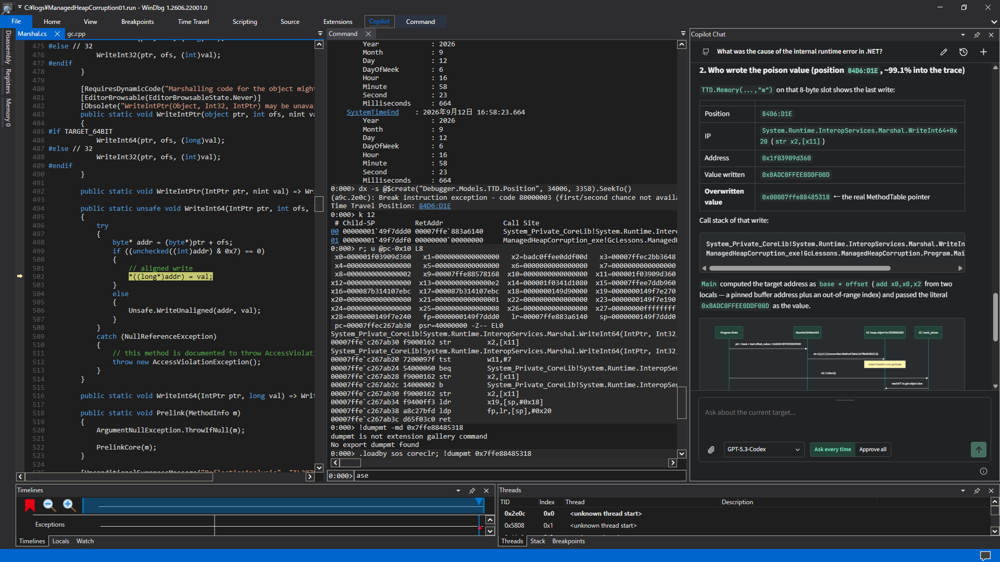

# WinDbg Copilot Chat

A [WinDbg](http://aka.ms/windbg) UI extension for [GitHub Copilot](https://github.com/features/copilot). You can interact with Copilot directly within WinDbg through this extension, and it provides autonomous troubleshooting capabilities for multiple debug targets.

This extension is based on a minimal WPF/MEF bootstrap, with a bundled [React UI](https://react.dev/) running in an isolated [WebView2](http://aka.ms/webview2) control, and a separately isolated C# core that integrates with the [GitHub Copilot SDK](https://github.com/github/copilot-sdk).

> [!IMPORTANT]
> This project is a personal learning experiment involving creating UI extensions for DbgX and integrating the GitHub Copilot SDK, and it is neither a supported product nor an official implementation sample for either SDK. Also, WinDbg's UI extension APIs are not fully documented, and very little information is found in the XML documentation included with the [DbgX NuGet package](https://www.nuget.org/packages/Microsoft.Debugging.Platform.DbgX/) and https://github.com/kevingosse/windbg-extensions. Use this extension at your own risk, and review source code if you have any concerns. If WinDbg becomes unstable or not launching after installing this extension or updating WinDbg, remove the extension and restart WinDbg.



## Requirements

To use the extension:

- WinDbg x64 or ARM64, version 1.2606.22001.0 or later.
- WebView2 Evergreen Runtime.
- GitHub Copilot access and the official GitHub Copilot CLI for authentication.

To build from source:

- PowerShell 7.4+.
- .NET 10 SDK.
- Node.js 22.12+ or 24+.

## Install a release

PowerShell 7.4+ is required. Windows PowerShell 5.1 is not supported.

1. Download the Windows ZIP matching WinDbg's architecture and its SHA-256 sidecar from GitHub Releases.
2. Verify the hash, then unblock the ZIP in Windows **Properties** before extracting it.
3. Keep the archive layout intact, close WinDbg, and run:

```powershell
pwsh -File ./scripts/install.ps1 -WhatIf
pwsh -File ./scripts/install.ps1
```

Restart WinDbg and open **Copilot > Chat**. Release binaries are unsigned; see [Releases](docs/releasing.md) for verification and packaging details. Uninstall with `pwsh -File ./scripts/uninstall.ps1`.

## Build and install

```powershell
./scripts/build.ps1
pwsh -File ./scripts/install.ps1 -WhatIf
pwsh -File ./scripts/install.ps1
```

The package is written to `artifacts/package`. Close WinDbg before installation. For the F5 workflow, test commands, approved-feed setup, and build troubleshooting, see [Development](docs/development.md).

## Using the extension

In the WinDbg ribbon, select **Copilot > Chat** to open the chat pane. Opening the pane attempts to connect with saved authentication. If necessary, use the GitHub account menu to sign in. New and resumed chats use **Ask every time** by default so debugger commands and result sharing require confirmation.

See [Usage](docs/usage.md) for authentication, logging, sessions, attachments, models, tools, MCP servers, local data, and safety guidance.

## Project documentation

- [Usage](docs/usage.md): user-facing behavior, configuration, local data, and safety.
- [Development](docs/development.md): builds, F5 debugging, tests, and package layout.
- [Design](docs/design.md): architecture, trust boundaries, and implementation decisions.
- [Validation](docs/validation.md): automated coverage and real-host checks.
- [Releases](docs/releasing.md): release verification, packaging, and publication.

The project's original source is licensed under the [MIT License](LICENSE). Dependencies remain under their own terms; see [Third-party dependencies](THIRD-PARTY-NOTICES.md).